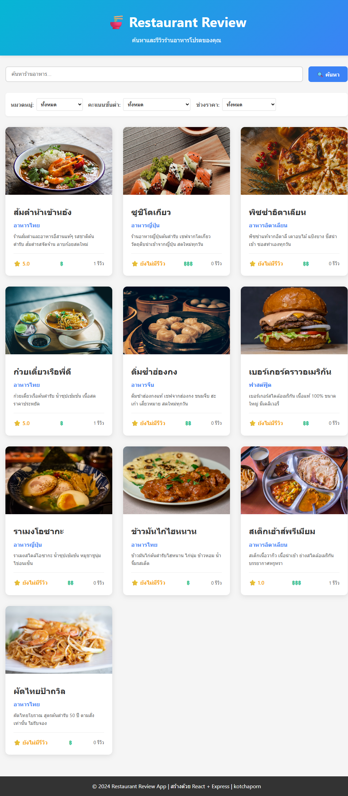
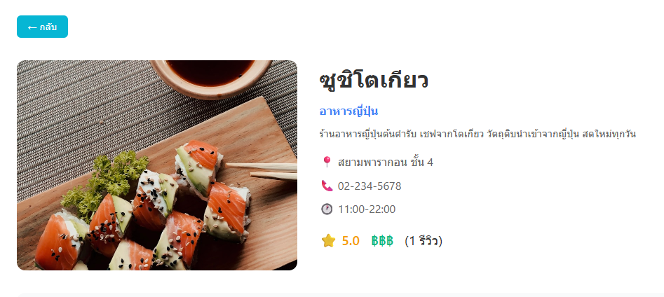
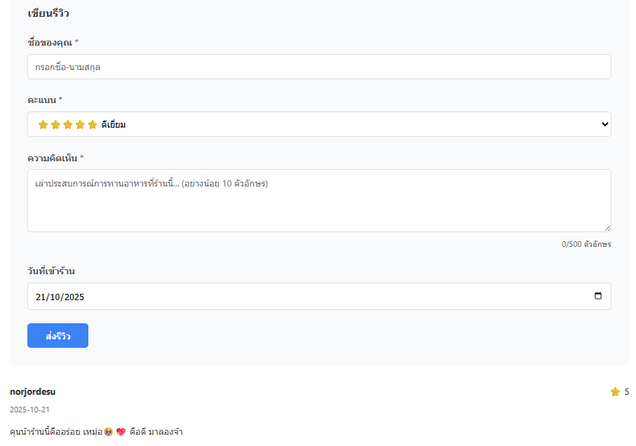
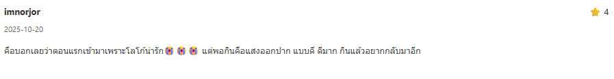
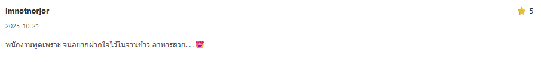

# Restaurant Review Website

## รายละเอียดโปรเจค
เว็บรีวิวร้านอาหารที่ช่วยให้ผู้ใช้สามารถ ค้นหา ดูรายละเอียด และรีวิวร้านอาหาร ได้อย่างสะดวก พร้อมระบบ กรองตามหมวดหมู่ ราคา และเรตติ้ง เพื่อให้ค้นหาร้านที่ต้องการได้ง่ายและรวดเร็ว

## เทคโนโลยีที่ใช้
- Frontend: React 18 + Vite
- Backend: Node.js + Express
- Database: JSON File Storage (จำลองฐานข้อมูล)

## Features
### Required Features (70 คะแนน)
- แสดงรายการร้านอาหารทั้งหมด
- ค้นหาร้านอาหารตามชื่อ
- กรองร้านตามหมวดหมู่ / เรตติ้ง / ช่วงราคา
- แสดงรายละเอียดร้านแต่ละแห่ง
- เพิ่มรีวิวใหม่พร้อมตรวจสอบข้อมูล
- ระบบคำนวณและอัปเดตค่าเฉลี่ยเรตติ้งอัตโนมัติ

## วิธีใช้งาน

### Backend
```
cd backend
npm install
cp .env.example .env
npm run dev
```

### Frontend
```
cd frontend
npm install
npm run dev
```

## API Endpoints
- GET `/api/restaurants` - ดึงรายการร้านทั้งหมด
- GET `/api/restaurants/:id` - ดึงข้อมูลร้านตาม ID
- POST `/api/reviews` - เพิ่มรีวิวร้าน
- GET `/api/stats` - ดึงข้อมูลสถิติของร้าน

## Screenshots
### หน้าแรก


### รายละเอียดร้าน


### ฟอร์มรีวิว






## ผู้จัดทำ
- นางสาวกชพร วงศ์ใหญ่
- รหัสนักศึกษา 67543210067-4
- email kotchaporn_wo67@live.rmutl.ac.th